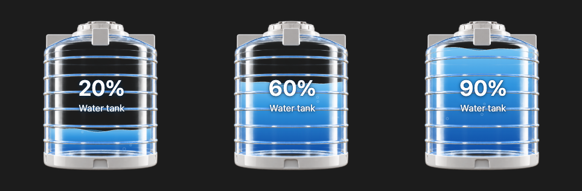
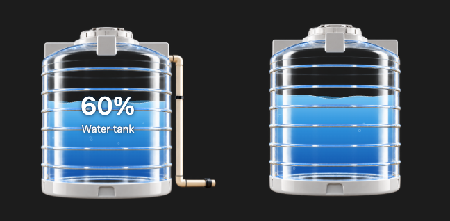

# Water Tank Card

A Home Assistant Lovelace card that shows a level sensor as an animated water tank.



The tank artwork is **intentionally fixed**: the card is built around a bundled render (with or without the side pipe via `show_pipe`), so it looks the same on every install. Custom backgrounds are supported. The tank render itself is not configurable (see [Using Your Own Tank Render](#using-your-own-tank-render)).

## Installation

### HACS
[](https://my.home-assistant.io/redirect/hacs_repository/?owner=adityasanehi&repository=water-tank-card&category=plugin)

Or add it manually:
1. HACS → ⋮ → Custom repositories → add this repo as category **Dashboard**.
2. Install **Water Tank Card** and reload the browser.

### Manual
1. Copy `dist/water-tank-card.js` to `/config/www/`.
2. Settings → Dashboards → Resources → add `/local/water-tank-card.js` (JavaScript module).

The tank image is embedded in the JS file. You never need to copy it into `/config/www`.

## Usage

Percentage entity:
```yaml
type: custom:water-tank-card
entity: sensor.water_tank_level_percent
```

Generic numeric entity (for example, metres):
```yaml
type: custom:water-tank-card
entity: sensor.cistern_depth
min: 0
max: 1.2
```

Custom background:
```yaml
type: custom:water-tank-card
entity: sensor.water_tank_level_percent
background_image: /local/terrace.jpg
background_fit: cover
background_position: center
```

With `show_pipe: true` (left) and with `show_percentage: false` / `show_name: false` (right):



No background (the default): omit `background_image` and the tank sits on a transparent card.

## Options

| Option | Default | Description |
|---|---|---|
| `entity` | required | Any sensor with a numeric state |
| `name` | friendly name | Label |
| `min` / `max` | `0` / `100` | Range for non-percentage entities |
| `background_image` | none | Image URL |
| `background_fit` | `cover` | `cover`, `contain` or `fill` |
| `background_position` | `center` | Any CSS background-position |
| `show_percentage` / `show_name` | `true` | |
| `show_pipe` | `false` | Use the tank render with the side pipe |
| `vertical_margin` | `16` | Space above and below the tank, in px |
| `animation` | `true` | Wave motion (also off with reduced-motion) |

## How percentage detection works

An entity is treated as a percentage if its `unit_of_measurement` is `%` or its `device_class` is `battery`, `humidity` or `moisture`. Its state is used directly. Any other entity uses `((state - min) / (max - min)) * 100`. The result is clamped to 0–100, and the text and the water height use the same value.

`unavailable`, `unknown`, non-numeric states, or `max <= min` show `--` and hide the water.

## Using Your Own Tank Render

The tank image is not a Lovelace option (other than `show_pipe`). To use another render:
1. Fork this repository.
2. Replace `assets/tank-only.png` (or `assets/tank-with-pipe.png` for the pipe variant) (a transparent PNG; the interior should be transparent so the water shows through).
3. Edit the matching entry in `src/tank-layout.js`: set `width`/`height` to the image size, and `fill` (left/right/top/bottom/radius, in image pixels) to the area the water should occupy.
4. Run `npm install && npm run build`, then use `dist/water-tank-card.js`.

## Development
`npm test` checks the level logic, and `npm run build` bundles to `dist/`.
